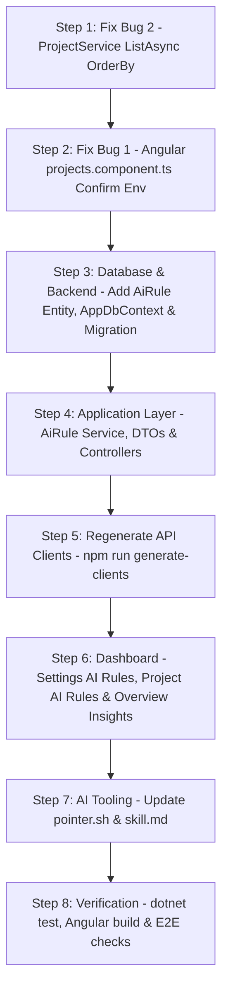

# Review & Comprehensive Implementation Plan: Environment Dialog Fix, Project List Sort Stability & AI Roles/Rules Feature

**Date:** 2026-09-08  
**Repositories:** `pointer-api` (.NET 8 Clean Architecture) & `pointer-dashboard` (Angular 22 / React / Vue)  
**Status:** Plan & Review (Awaiting User Feedback Before Implementation)

---

## 1. Review of the Provided Bugfix Plan

### 1.1 Bug 1: "Add Environment" Button Only Works Once per Dialog Session (Angular)
- **Reviewer Assessment:** **Strong diagnosis with minor UX/safety gaps.**
- **Strengths of the provided plan:**
  - Accurately identified that the draft row state (`showAddEnvRow`, `newEnvId`, `newEnvUrl`, `newEnvActive`) was tied strictly to the dialog-wide `saveEdit()`, which unconditionally invokes `dialogRef?.close()` on completion.
  - Correctly spotted that `clearEnvironmentUrl()` already establishes an immediate per-row API call pattern (`projectsService.deleteApiAdminProjectsIdAppUrlsEnvironmentId`). Matching this pattern with an immediate `confirmAddEnvironment()` is clean, idiomatic, and solves the single-use problem.
  - Leaving `saveEnvironmentChangesIfPending()` as a fallback ensures that if an admin enters environment details and hits the primary "Save" button without clicking the checkmark first, their input is not lost.
- **Identified Gaps & Proposed Enhancements:**
  1. **In-Flight / Double-Click Prevention:** The plan lacked an in-flight loading flag. Without it, rapid clicks on the checkmark could trigger duplicate `PUT` calls. We must introduce `isAddingEnv = signal(false)` to disable both the confirm button and the inputs while the request is pending.
  2. **Error Recovery:** If the `PUT` fails (e.g. invalid URL or network blip), the error message should be displayed via `MatSnackBar` (matching `clearEnvironmentUrl`), and the draft row must **remain open and populated** so the user can fix the input without starting over.
  3. **Multi-Client Parity Note:** The prompt mentions "user asked to fix Angular only for now." While we implement Angular first, the Pointer architecture rule (`AGENTS.md`) requires feature parity across `angular/`, `react/`, and `vue/`. We will document the exact React/Vue parity steps so they can be executed next.

### 1.2 Bug 2: Project List Re-Sorts After Every Edit (.NET Backend)
- **Reviewer Assessment:** **Accurate root cause and correct resolution.**
- **Strengths of the provided plan:**
  - Accurately identified `ProjectService.ListAsync()` at lines 138–142:
    ```csharp
    var projects = await _unitOfWork.Repository<Project>()
        .Query().AsNoTracking().Where(p => p.DeletedAt == null).ToListAsync();
    ```
  - Accurately explained PostgreSQL's MVCC heap scan mechanics: updates create new row versions in new disk pages, causing rows to return in nondeterministic physical order when no `ORDER BY` is specified.
  - Accurately noted that `Project` inherits `CreatedAt` from `BaseEntity`, and edits update `UpdatedAt`, leaving `CreatedAt` stable.
- **Identified Gaps & Proposed Enhancements:**
  1. **Deterministic Secondary Sort (Tie-Breaker):** If multiple projects are created simultaneously (e.g. during database seeds, imports, or test fixtures), `CreatedAt` timestamps may collide. Adding `.ThenByDescending(p => p.Id)` ensures 100% deterministic ordering in all environments.
  2. **Query Audit:** Checked other project retrieval queries in `ProjectService`. Other endpoints either look up by ID/Key or already filter by specific criteria.

---

## 2. Feature Specification: AI Roles & Rules (Tenant & Project Scoped)

### 2.1 Overview & Requirements
- **Goal:** Allow workspace admins and users to define predefined prompts ("AI Rules" / "AI Roles") that act as instructions for all AI coding agents (`claude-code`, `opencode-glm`, `cursor`, `antigravity`, `windsurf`) operating on that tenant or project.
- **Example Use Case:**
  > *"Always clean the provided HTML code examples and remove useless divs if possible. You should follow Tailwind CSS classes instead of using custom classes."*
- **Scoping Hierarchy:**
  - **Tenant-wide Rules (`ProjectId == null`):** Defined at the tenant level (in Settings). Automatically applies to all projects belonging to that tenant.
  - **Project-specific Rules (`ProjectId != null`):** Defined on a specific project (in Project Edit/Settings). Applies specifically to that project.
  - **Effective Rules Resolution:** When an AI tool connects or fetches the apply-queue, the API merges:
    $$\text{Effective Rules} = \text{Tenant Rules (Active)} + \text{Project Rules (Active)}$$
    Sorted by `SortOrder` and optionally filtered by target AI tool.
- **User Personas & Permissions:**
  - **Workspace Users & Admins ("for all users"):** Can view, configure, and manage rules for their workspace and projects. They are the actual users of Pointer and its connected AI tools.
  - **Super Admin ("not super admin while he can't/shouldn't use the tool but it should be displayed somewhere as insights"):**
    - Under Pointer's multi-tenancy model, Super Admins operate the platform. They do not own projects and cannot run AI tools on customer projects (`extension/src/background.ts` blocks Super Admin logins for this reason).
    - **Insights Display:** Super Admin (and dashboard overviews) will have an **AI Insights** surface displaying:
      - Total active AI rules configured across tenants.
      - Breakdown of rules by tenant and by project.
      - AI tool adoption stats (derived from `Project.AiToolsUsed`).
      - High-level insight summaries into how AI agents are guided across workspaces.

---

## 3. Technical Architecture & Database Design

### 3.1 Domain Entity: `AiRule`
Create `Domain/Entity/AiRule.cs`:

```csharp
namespace Pointer.Domain.Entity;

/// <summary>
/// A predefined prompt/instruction acting as a rule for AI coding tools
/// (Claude Code, OpenCode, Cursor, Antigravity, etc.) operating on a tenant or project.
/// Scope:
///   - Tenant-wide: ProjectId == null
///   - Project-scoped: ProjectId != null
/// </summary>
public class AiRule : BaseEntity
{
    /// <summary>Tenant isolation boundary (DB-enforced NOT NULL for tenant users).</summary>
    public Guid? OwnerId { get; set; }

    /// <summary>null = tenant-wide; non-null = project-specific.</summary>
    public int? ProjectId { get; set; }
    public Project? Project { get; set; }

    /// <summary>Short label or persona/role name (e.g. "Tailwind Cleanliness", "TypeScript Strictness").</summary>
    public string Title { get; set; } = string.Empty;

    /// <summary>The prompt/rule instruction provided to AI tools (Postgres text).</summary>
    public string Prompt { get; set; } = string.Empty;

    /// <summary>Target tool filter (null or "all" = applies to all tools; or specific e.g. "claude-code").</summary>
    public string? TargetTool { get; set; }

    public bool IsActive { get; set; } = true;

    public int SortOrder { get; set; } = 0;
}
```

### 3.2 EF Core Entity Mapping & Multitenancy Query Filter
1. **Mapping (`Infrastructure/Mappings/AiRuleMapping.cs`):**
   - Table name: `ai_rules`
   - Columns: `id`, `owner_id`, `project_id`, `title` (varchar 256), `prompt` (text), `target_tool` (varchar 64), `is_active` (bool), `sort_order` (int), `created_at`, `updated_at`, `created_by`, `deleted_at`.
   - Foreign key: `project_id` references `projects(id)` with `OnDelete(DeleteBehavior.Cascade)`.
   - Indexes: `(owner_id, project_id)`, `(project_id, is_active)`.
2. **AppDbContext Query Filter (`Infrastructure/AppDbContext.cs`):**
   ```csharp
   b.Entity<AiRule>().HasQueryFilter(e =>
       currentUser.IsSuperAdmin ||
       (currentUser.TenantId != null && (e.OwnerId == currentUser.TenantId || e.OwnerId == null)) ||
       (currentUser.TenantId == null && !strict && e.OwnerId == null)
   );
   ```
3. **Migration:** Add EF Core migration `AddAiRulesTable`.

---

## 4. Application Layer & API Endpoints

### 4.1 DTOs (`Application/DTOs/AiRule/`)
- `AiRuleResponse`:
  ```csharp
  public class AiRuleResponse
  {
      public int Id { get; set; }
      public int? ProjectId { get; set; }
      public string? ProjectName { get; set; }
      public string Title { get; set; } = string.Empty;
      public string Prompt { get; set; } = string.Empty;
      public string? TargetTool { get; set; }
      public bool IsActive { get; set; }
      public int SortOrder { get; set; }
      public DateTime CreatedAt { get; set; }
      public bool IsTenantWide => ProjectId == null;
  }
  ```
- `CreateAiRuleRequest`:
  - `ProjectId` (int? - optional)
  - `Title` (string, required, max 256)
  - `Prompt` (string, required)
  - `TargetTool` (string?, optional)
  - `SortOrder` (int)
- `UpdateAiRuleRequest`:
  - `Title` (string, required)
  - `Prompt` (string, required)
  - `TargetTool` (string?, optional)
  - `IsActive` (bool)
  - `SortOrder` (int)
- `AiInsightsResponse`:
  ```csharp
  public class AiInsightsResponse
  {
      public int TotalActiveRules { get; set; }
      public int TenantWideRulesCount { get; set; }
      public int ProjectSpecificRulesCount { get; set; }
      public Dictionary<string, int> ToolsActiveCount { get; set; } = new();
      public List<AiRuleResponse> RecentRules { get; set; } = new();
  }
  ```

### 4.2 Service Interface & Implementation
`IAiRuleService` in `Application/Services/Interfaces/IAiRuleService.cs`:
- `Task<Result<List<AiRuleResponse>>> ListTenantRulesAsync()`
- `Task<Result<List<AiRuleResponse>>> ListProjectRulesAsync(int projectId)`
- `Task<Result<List<AiRuleResponse>>> GetEffectiveRulesForProjectAsync(string projectKey, string? tool = null)`
- `Task<Result<AiRuleResponse>> CreateAsync(CreateAiRuleRequest request)`
- `Task<Result<AiRuleResponse>> UpdateAsync(int id, UpdateAiRuleRequest request)`
- `Task<Result> DeleteAsync(int id)`
- `Task<Result<AiInsightsResponse>> GetInsightsAsync()`

### 4.3 Controllers
1. **`API/Controllers/Admin/AiRulesController.cs` (`[Authorize(Policy = Policies.Admin)]`):**
   - `GET /api/admin/ai-rules/tenant` → lists tenant-wide rules.
   - `GET /api/admin/ai-rules/project/{projectId}` → lists project-specific rules.
   - `POST /api/admin/ai-rules` → creates a tenant or project rule.
   - `PUT /api/admin/ai-rules/{id}` → updates a rule.
   - `DELETE /api/admin/ai-rules/{id}` → soft-deletes a rule.
   - `GET /api/admin/ai-rules/insights` → returns AI insights (accessible to admins and Super Admin).
2. **`API/Controllers/ProjectsController.cs` (or agent endpoint):**
   - `GET /api/projects/{key}/ai-rules` → returns effective rules for the project (authenticated with Bearer token or API key).
3. **Payload Enrichment in Apply-Queue:**
   - In `GET /api/admin/projects/{key}/apply-queue`, include `aiRules: [...]` in the response payload. When AI agents run `pointer.sh queue`, they immediately receive the active rules without making an additional round trip!

---

## 5. AI Tooling Integration (`skill.md` & `pointer.sh`)

### 5.1 Updates to `API/wwwroot/pointer.sh`
In `pointer.sh`:
- When running `queue` or `apply`:
  - Fetch effective rules (or parse from the enriched apply-queue payload).
  - Print an active guidelines section:
    ```
    === Active AI Rules for <project> ===
    [Rule 1: Tailwind Cleanliness] always clean the provided html code examples and remove the useless divs if possible and you should follow tailwindcss classes instead of using custom classes.
    ```
  - This ensures LLM agents ingesting CLI stdout will immediately notice and adhere to these guidelines.

### 5.2 Updates to `API/wwwroot/skill.md`
- In **Section 2 (Critical Rules for AI Agents)** and **Section 5 (Apply)**:
  - Add an explicit directive instructing the AI agent to prioritize and strictly follow any project/tenant AI rules provided by the apply queue or `pointer.sh`.

---

## 6. Frontend Implementation Plan (`pointer-dashboard`)

### 6.1 Bug 1 Implementation in Angular (`angular/src/app/features/projects/projects.component.ts`)
1. **Signal additions:**
   ```typescript
   isAddingEnv = signal(false);
   ```
2. **Method implementation (`confirmAddEnvironment`):**
   ```typescript
   confirmAddEnvironment(): void {
     const projectId = this.editingProjectId();
     const envId = this.newEnvId();
     const url = this.newEnvUrl().trim();
     if (!projectId || !envId || !url) return;

     this.isAddingEnv.set(true);
     this.projectsService.putApiAdminProjectsIdAppUrlsEnvironmentId(projectId, envId, {
       url,
       isActive: this.newEnvActive(),
     } as any).subscribe({
       next: () => {
         this.isAddingEnv.set(false);
         this.showAddEnvRow.set(false);
         this.newEnvId.set(null);
         this.newEnvUrl.set('');
         this.newEnvActive.set(true);
         this.projectAppUrlsResource.reload();
         this.snack.open(this.transloco.translate('projects.environmentAdded') || 'Environment added', 'OK', { duration: 3000 });
       },
       error: (e: unknown) => {
         this.isAddingEnv.set(false);
         this.snack.open(extractMessage(e), 'OK', { duration: 4000 });
       }
     });
   }
   ```
3. **Template modification (lines 328–334):**
   ```html
   <td class="py-1 align-middle whitespace-nowrap">
     <button mat-icon-button type="button" color="primary"
       [disabled]="isAddingEnv() || !newEnvId() || !newEnvUrl().trim()"
       [attr.aria-label]="'common.add' | transloco"
       (click)="confirmAddEnvironment()">
       <mat-icon>check</mat-icon>
     </button>
     <button mat-icon-button type="button"
       [disabled]="isAddingEnv()"
       [attr.aria-label]="'common.cancel' | transloco"
       (click)="cancelAddEnvironment()">
       <mat-icon>close</mat-icon>
     </button>
   </td>
   ```

### 6.2 Bug 2 Implementation in `pointer-api` (`Application/Services/Implementation/ProjectService.cs`)
Modify line 138 in `ListAsync()`:
```csharp
var projects = await _unitOfWork.Repository<Project>()
    .Query()
    .AsNoTracking()
    .Where(p => p.DeletedAt == null)
    .OrderByDescending(p => p.CreatedAt)
    .ThenByDescending(p => p.Id)
    .ToListAsync();
```

### 6.3 AI Roles & Rules UI in Dashboard
1. **Tenant-wide Rules in Settings (`angular/src/app/features/settings/settings.component.ts`):**
   - Add an expansion panel: **"AI Roles & Rules"** (`aiRules.sectionTitle`).
   - Displays list of tenant-wide AI rules with Title, Prompt preview, Active toggle, Edit, and Delete actions.
   - Inline form to add a new tenant-level rule (`Title`, `Prompt`, optional `TargetTool`).
2. **Project-specific Rules in Project Edit (`angular/src/app/features/projects/projects.component.ts`):**
   - Add an accordion or tab in the project edit dialog: **"AI Rules"**.
   - Displays existing project rules, plus inherited tenant rules (read-only indicator: *"Inherited from Tenant"*).
   - Allows adding project-specific rules that apply when AI tools operate on this project.
3. **AI Insights in Overview & Super Admin (`angular/src/app/features/overview/overview.component.ts`):**
   - Add an **AI Insights** stat card / panel:
     - Metric: Count of configured AI rules & connected AI tools.
     - For Super Admin: Platform-wide AI insights card showing adoption of AI rules and AI tool breakdown (`claude-code`, `opencode-glm`, `cursor`, `antigravity`).
4. **Translations (`en.json` & `ar.json`):**
   - Add all keys for `aiRules` and `overview.aiInsights` in both English and Arabic.

---

## 7. Step-by-Step Execution Sequence



1. **Bug 2:** Update `ProjectService.cs` in `pointer-api` with `.OrderByDescending(p => p.CreatedAt).ThenByDescending(p => p.Id)`.
2. **Bug 1:** Update `projects.component.ts` in `pointer-dashboard/angular` with `confirmAddEnvironment()` and template checkmark button.
3. **Backend Feature:**
   - Create `Domain/Entity/AiRule.cs` and `Infrastructure/Mappings/AiRuleMapping.cs`.
   - Update `Infrastructure/AppDbContext.cs` query filter.
   - Run EF Core migration `AddAiRulesTable`.
   - Create DTOs, `IAiRuleService`, `AiRuleService`, `AiRulesController`.
   - Update `ProjectsController` & `apply-queue` payload to supply effective rules.
   - Update `StatsController` / `AiRulesController` to serve AI insights.
4. **Regenerate Clients:** Run `npm run generate-clients` in `pointer-api`.
5. **Frontend Feature (Angular):**
   - Implement AI Rules management in `settings.component.ts`.
   - Implement Project AI Rules in `projects.component.ts`.
   - Implement AI Insights in `overview.component.ts`.
   - Add translations in `public/assets/i18n/{en,ar}.json`.
6. **CLI & Skill:**
   - Update `API/wwwroot/pointer.sh` and `API/wwwroot/skill.md`.
7. **Verification & Testing:**
   - Run `dotnet test` in `pointer-api`.
   - Run `npm run build` in `pointer-dashboard/angular`.
   - Validate behavior in browser and test API endpoints.
